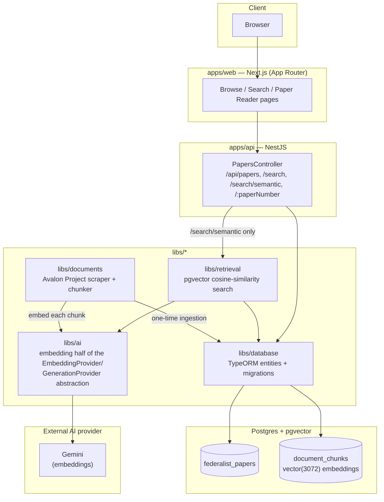
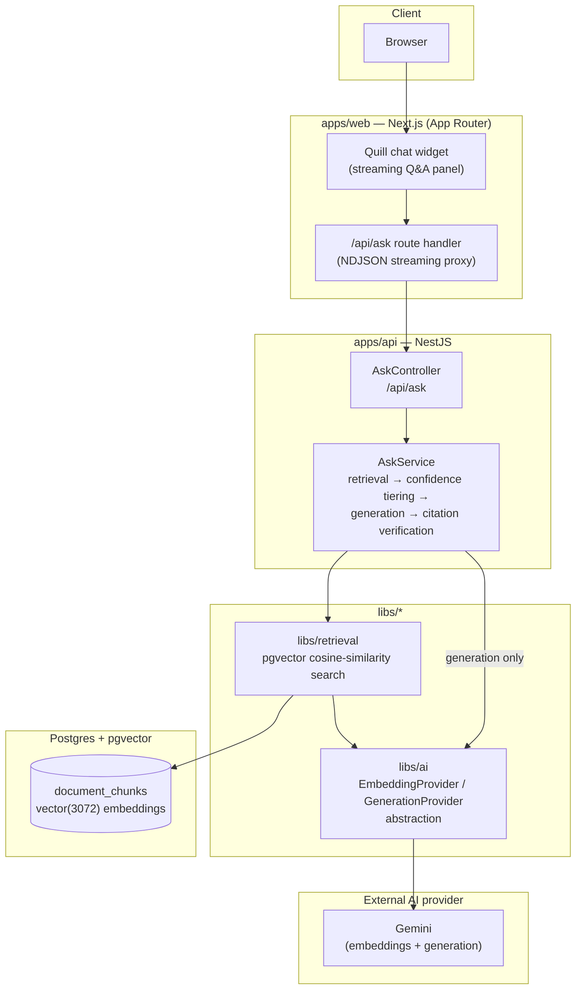

# Federalist Papers Research Assistant

A RAG (retrieval-augmented generation) research assistant for the 85 Federalist Papers. Browse
and search the full archive, or ask a natural-language question and get an answer grounded
directly in the source text, with every claim traceable back to the exact paper and passage it
came from.

Built as an Nx monorepo: a Next.js frontend, a NestJS API, and a Postgres + pgvector store for
semantic search over the full corpus.

## How this was built

This project was built end-to-end using **BMAD** (spec-first, agent-driven development), not
freehand vibe-coding. The actual process, repeated for every feature:

1. **Spec first.** Before any code, a spec is written and frozen: intent, boundaries ("always" /
   "never" constraints), and an I/O & edge-case matrix. The spec — not a chat message — is the
   source of truth an implementation is built against.
2. **Implement against the frozen spec**, with test coverage mapped explicitly back to every row
   of that matrix — not just the happy path.
3. **Four independent review passes** run in parallel over every diff before it's considered
   done: a blind bug hunter, an edge-case hunter, a verification-gap reviewer (does the test suite
   actually prove what it claims to?), and an intent-alignment auditor (does the implementation
   match the spec's *intent*, not just its literal wording?). Findings are triaged into
   patch / defer / reject, logged in the spec itself, and only real, in-scope issues get fixed
   before merge.
4. **Every story ships as its own reviewed PR** — `docs/implementation/spec-*.md` has the full
   paper trail for each one: the problem, the approach, what was deferred and why, and the actual
   review findings.

This is also why the repo's git history reads as a series of scoped, individually-reviewable
stories rather than one large, undifferentiated commit.

## Architecture

Two Mermaid diagrams below, each scoped to one user journey through the system: browsing/searching
the already-ingested archive, and asking the chat widget a question. `libs/shared` (compile-time
type sharing between `apps/web`/`apps/api`) is omitted from both — it carries no runtime request
in either journey. Several nodes (`Browser`, `libs/retrieval`, `libs/ai`, `Gemini`,
`document_chunks`) appear in both diagrams — they're the same real components, repeated so each
journey reads standalone rather than sharing a cross-reference.

### Browse & Search the Archive



**Request flow for browsing/searching the archive:**

1. The Browse Papers, Search, and Paper Reader pages all call `apps/api`'s `PapersController`,
   which exposes `GET /api/papers` (full list), `GET /api/papers/search` (quick find by number/
   author/title/keyword), `GET /api/papers/search/semantic` (semantic search), and
   `GET /api/papers/:paperNumber` (one paper's full detail).
2. `GET /api/papers`, `/search`, and `/:paperNumber` are direct relational queries against
   `libs/database`. Only `/search/semantic` calls `libs/retrieval`, which embeds the query via
   `libs/ai`/Gemini and runs a cosine-similarity search over `document_chunks`.
3. All of this reads data that a one-time ingestion pipeline (`npm run ingest:federalist-papers`)
   already populated: `libs/documents` scrapes and chunks the 85 papers from the Avalon Project,
   each chunk is embedded via `libs/ai`, and both the paper records and their embedded chunks are
   written to Postgres through `libs/database`. Ingestion never runs as part of a live request —
   it's how the data got there in the first place.

### Ask the Archive (chat widget)



**Request flow for a question asked in the chat widget:**

1. The question (plus recent conversation history and, if the user is reading a specific paper,
   that paper's number as prompt context) is sent to `apps/api`'s `AskController`.
2. `AskService` embeds the query (`libs/ai`, always via Gemini — the `document_chunks.embedding`
   column is pinned to `gemini-embedding-001`'s 3072-dimension output) and runs a cosine-similarity
   search over `document_chunks` (`libs/retrieval`).
3. The top match's similarity score decides a **confidence tier in code**, never by trusting the
   model's own self-reported confidence: a high-confidence match calls the generation provider for
   a grounded answer; a borderline match returns a templated "did you mean Paper N?" clarification;
   a weak match refuses rather than guessing.
4. Every citation the model returns is verified against the chunk IDs actually retrieved before
   it's ever sent to the client — a citation that doesn't check out fails the whole answer safe,
   rather than shipping an unverified claim.
5. The answer streams back to the browser token-by-token over NDJSON, with citations attached only
   once the full answer is verified.

## Tech stack

- **Frontend:** Next.js 16 (App Router), Tailwind CSS v4, shadcn/ui primitives
- **Backend:** NestJS 11, TypeORM
- **Database:** Postgres with the `pgvector` extension
- **AI:** Gemini, for both embeddings and generation, via a `@langchain`-based adapter behind a
  `EmbeddingProvider`/`GenerationProvider` interface (`libs/ai`) — the abstraction exists so a
  second provider could be swapped in without touching any call site outside that lib, though
  Gemini is the only one actually in use
- **Monorepo:** Nx

## Quickstart

```bash
npm install
docker-compose up -d          # starts Postgres with pgvector
cp apps/api/.env.example apps/api/.env   # then fill in GEMINI_API_KEY
npm run db:migrate
npm run ingest:federalist-papers          # one-time: scrape + chunk + embed all 85 papers
npm run dev                    # runs apps/web (:3000) and apps/api (:3333) together
```

## Demo

_Video coming soon._

## License

MIT — see [LICENSE](./LICENSE).
