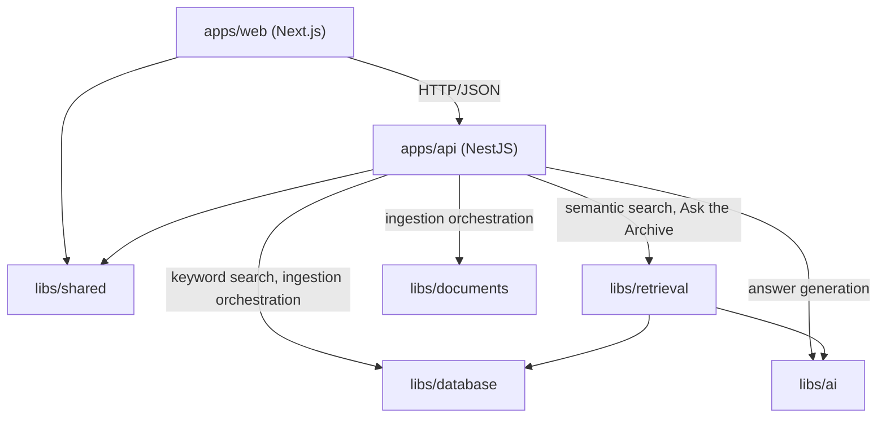

# Architecture Spine — Federalist Research

## Design Paradigm

**Layered architecture**, expressed as Nx dependency-constrained libs plus NestJS's own module/controller/service layering:

- **Leaf layer** (`libs/database`, `libs/ai`, `libs/documents`) — narrow, single-concern, no cross-dependencies between siblings.
- **Retrieval layer** (`libs/retrieval`) — composes `database` + `ai` for the read path; stays domain-naive (chunks + scores in, chunks + scores out).
- **Application layer** (`apps/api`) — the only place request-specific business logic lives: answer orchestration (confidence tiering, prompt construction, citation verification) and ingestion orchestration (composing `documents` + `ai` + `database` for the write path). Also owns query paths that don't need the full RAG pipeline (e.g. keyword search directly against `database`).
- **Presentation layer** (`apps/web`) — consumes `apps/api` over HTTP only; never imports backend libs directly.

## Invariants & Rules



### AD-1 — Deployment target: Vercel + Neon, Postgres 18

- **Binds:** all runtime infrastructure
- **Prevents:** assuming a single always-on process exists in production; assuming pgvector's latest features are available regardless of Postgres major version
- **Rule:** `apps/web` and `apps/api` deploy as two separate Vercel projects (api via Vercel's native NestJS serverless support; CORS enabled on api for web's origin). Postgres+pgvector runs on Neon, **pinned to a Postgres 18 project** — Neon serves pgvector 0.8.6 only on PG18 projects; PG14–17 projects are held back to the older pgvector 0.8.0. No self-managed servers.

### AD-2 — Rate-limit counters (per-IP and daily) are DB-backed, not in-memory

- **Binds:** both rate-limit tiers in `decisions.md` ("Rate limiting")
- **Prevents:** either counter silently resetting on a serverless cold start, which would happen if either were in-memory
- **Rule:** both the per-IP throttle and the global daily cap are rows in Postgres, mutated via atomic `UPDATE`/`UPSERT` — same mechanism, different key: `(ip, minute-bucket)` for the per-IP tier, `(global, date)` for the daily tier. No Redis, no in-memory counters anywhere in the rate-limiting path.

### AD-3 — Neon pooled connection required

- **Binds:** all `apps/api` → Postgres connections
- **Prevents:** exhausting Postgres's connection limit under serverless concurrency (each cold invocation can open a fresh connection)
- **Rule:** `DATABASE_URL` in production always points at Neon's pooled connection endpoint, never the direct one.

### AD-4 — Docker Compose is a local-dev-only tool

- **Binds:** local development setup
- **Prevents:** Docker Compose being mistaken for, or reimplemented as, a deployment mechanism
- **Rule:** Compose runs exactly one service — a `pgvector/pgvector` Postgres container, pinned to Postgres 18 to match AD-1. `apps/api` and `apps/web` run as normal local processes (`nest start`, `next dev`), never containerized. Production deploys directly from source via Vercel; Docker plays no role there.

### AD-5 — Environment differences are env-vars only

- **Binds:** all environment-dependent configuration (DB target, AI provider keys)
- **Prevents:** hardcoded local values or environment-conditional code branches (`if isProd`)
- **Rule:** every environment difference is expressed through an environment variable read at runtime (`DATABASE_URL`, provider API key, etc.). No code path branches on which environment it's running in.

### AD-6 — Leaf libs have zero cross-dependencies

- **Binds:** `libs/database`, `libs/ai`, `libs/documents`
- **Prevents:** any leaf lib reaching into another's domain
- **Rule:** these three libs never import from each other. `database` owns Postgres/pgvector schema + repositories; `ai` owns the provider abstraction and has zero knowledge of Federalist Papers as a domain; `documents` owns parsing/chunking only — no I/O, no embedding calls, no DB calls.

### AD-7 — Retrieval stays domain-naive

- **Binds:** `libs/retrieval`
- **Prevents:** confidence-threshold or citation logic leaking into the retrieval layer
- **Rule:** `retrieval` depends on `database` (pgvector query) and `ai` (query embedding) and returns chunks *with their similarity scores* — nothing more. It has no concept of a confidence threshold or a citation; the caller (the `apps/api` orchestrator) reads the top score and applies threshold logic itself. Separately, retrieval *does* own enforcing that `paperNumber`/`author` filters apply in the SQL `WHERE` clause before the top-K `LIMIT` — a keyword-style filter, not a score judgment, so it doesn't conflict with the rule above. (`architecture-diagrams.md`'s `retrieveRelevantChunks` signature was amended 2026-08-24 to match this — it previously listed confidence thresholds as retrieval options, which this AD supersedes.)

### AD-8 — Orchestration lives in `apps/api`, not a shared lib

- **Binds:** answer-generation orchestration (confidence-threshold check, prompt construction, citation verification, structured-response assembly)
- **Prevents:** a premature shared-lib abstraction built for a consumer that doesn't exist yet
- **Rule:** the orchestrating service lives directly in `apps/api`, depending on `retrieval` + `ai`. Promote it to `libs/rag` only when a second real consumer of the *orchestrator itself* appears (a CLI, a worker, another app calling the full confidence-tiering/citation-verification pipeline). The retrieval evaluation script does **not** count toward this trigger — it calls `libs/retrieval` directly (already a multi-consumer-safe leaf lib per AD-7) and never touches the orchestrator.

### AD-9 — Shared schemas, single source of truth, both directions

- **Binds:** the `Answer`/`Citation` API contract (read path) and the ingestion chunk DTOs (write path)
- **Prevents:** `apps/api` and `apps/web` drifting on the response shape independently; `documents`, `ai`, and `database` drifting on the ingestion chunk shape independently
- **Rule:** the Zod schema (and inferred TypeScript type) for `Answer`/`Citation` lives in `libs/shared`; both apps import it, neither redeclares it. Symmetrically, the parsed-chunk shape (`documents` → `ai`) and the chunk-with-embedding shape (`ai` → `database`) also live in `libs/shared`, imported by all three.

### AD-10 — Per-paper ingestion is one transaction

- **Binds:** the ingestion write path (`FederalistPaper` upsert + `DocumentChunk` delete + `DocumentChunk` insert)
- **Prevents:** a crash mid-ingestion leaving a paper with updated metadata but missing or partial chunks — silently unsearchable
- **Rule:** all three steps for a single paper run inside one database transaction. A failure rolls the paper back to its last-good state; it never lands half-updated.

### AD-11 — Ingestion orchestration mirrors answer orchestration `[ADOPTED — generalized from AD-6/7/8]`

- **Binds:** the write path (`libs/documents` + `libs/ai` + `libs/database` composition)
- **Prevents:** `libs/documents` accumulating I/O/embedding responsibilities that belong to an orchestrator, the same drift AD-7/AD-8 prevent on the read path
- **Rule:** the ingestion script/command is a thin orchestrator (in `apps/api`, e.g. a Nest standalone command) that fetches the source document, then composes `documents` (parse/chunk) + `ai` (embed) + `database` (store), applying AD-10's transaction rule. `documents` itself performs no I/O — the HTTP fetch from the Avalon Project is the orchestrator's job, not `documents`'.

## Consistency Conventions

| Concern | Convention |
| --- | --- |
| Naming (entities, files, interfaces, events) | Entities PascalCase (`FederalistPaper`, `Author`, `DocumentChunk`); Nx libs kebab-case; NestJS modules/services/controllers follow standard Nest naming (`*.module.ts`, `*.service.ts`, `*.controller.ts`) |
| Data & formats (ids, dates, error shapes, envelopes) | Dates ISO 8601; API errors use NestJS's default `HttpException` shape (`statusCode`, `message`, `error`) — no custom error envelope invented. Primary-key type (UUID vs. serial) intentionally left to the migration author — see Deferred |
| State & cross-cutting (mutation, errors, logging, config, auth) | Single write path is ingestion (AD-10); no auth (SPEC.md Constraints); logging via NestJS `Logger`, captured by Vercel's built-in function logs — no separate logging service; all config via env vars (AD-5); rate-limit state via Postgres (AD-2) |

## Stack

| Name | Version |
| --- | --- |
| Next.js | 16.3.2 |
| NestJS (`@nestjs/core`) | 11.2.1 |
| TypeORM | 1.1.0 |
| PostgreSQL | 18.6 (pinned to major version 18 — see AD-1) |
| pgvector | 0.8.6 (on Neon's PG18 projects; PG14–17 projects get 0.8.0 — see AD-1) |
| LangChain.js (`langchain` / `@langchain/core`) | 1.5.10 / 1.2.8 |
| Zod | 4.4.3 |
| Vercel (hosting) | Native NestJS support confirmed 2026-07-06 |
| Neon (Postgres host) | Free tier confirmed permanent (not trial), pgvector included, verified 2026-08-24 |

## Structural Seed

```text
apps/
  web/        # Next.js frontend — consumes apps/api over HTTP only
  api/        # NestJS backend — controllers, answer orchestration, ingestion orchestration,
              #   keyword-search path, rate-limit middleware

libs/
  ai/         # AI provider abstraction (generateAnswer/generateStructuredOutput/generateEmbedding)
  database/   # Postgres/pgvector schema + repositories (FederalistPaper, Author, DocumentChunk,
              #   rate-limit counter table)
  documents/  # Parsing + chunking only, no I/O
  retrieval/  # Composes database+ai for vector search; returns chunks+scores only
  shared/     # Zod schemas: Answer/Citation (read path) + ingestion chunk DTOs (write path)
```

## Capability → Architecture Map

| Capability / Area | Lives in | Governed by |
| --- | --- | --- |
| CAP-1 Browse | `apps/web` (list view) ← `apps/api` (paper list endpoint) ← `libs/database` | AD-6 |
| CAP-2 Search | `apps/api` search endpoint → `libs/retrieval` (semantic) + `libs/database` directly (keyword/full-text — no orchestration needed for a plain filter query) | AD-7 (semantic half); direct `api`→`database` edge (keyword half) |
| CAP-3 Ask the Archive | `apps/api` orchestrating service → `libs/retrieval` → `libs/ai` | AD-7, AD-8 |
| CAP-4 Tiered confidence response | `apps/api` orchestrating service | AD-8; threshold values per `decisions.md` "Confidence tiering" |
| CAP-5 Verified citations | `apps/api` orchestrating service | AD-8; retry-then-fail-safe policy per `decisions.md` "Citation verification" |
| CAP-6 Passage-in-context navigation | `apps/web` reader view, using `paperNumber` + client-held `quotedPassage` from the answer already received — no re-fetch by `chunkId` | `architecture-diagrams.md`, "Navigating from a citation to its passage" |
| CAP-7 Independent source verification | `apps/web` reader view (`sourceUrl` display) | `decisions.md` "Verification link placement" |

## Deferred

- **Exact `confidentThreshold`/`clarifyThreshold` values** — requires empirical calibration against the retrieval evaluation dataset once an embedding model is chosen; not an architecture-time decision (see `decisions.md`).
- **Promotion of `apps/api` orchestration to `libs/rag`** — deferred until a second real consumer of the *orchestrator* (not retrieval) exists (AD-8).
- **Primary-key type for entities (UUID vs. serial)** — low-stakes, single-schema decision; left to the migration author, not fixed here.
- **Whether a lightweight reranker is ever added** — not currently warranted (see SPEC.md Open Questions); revisit only if real retrieval quality proves weaker than expected.
